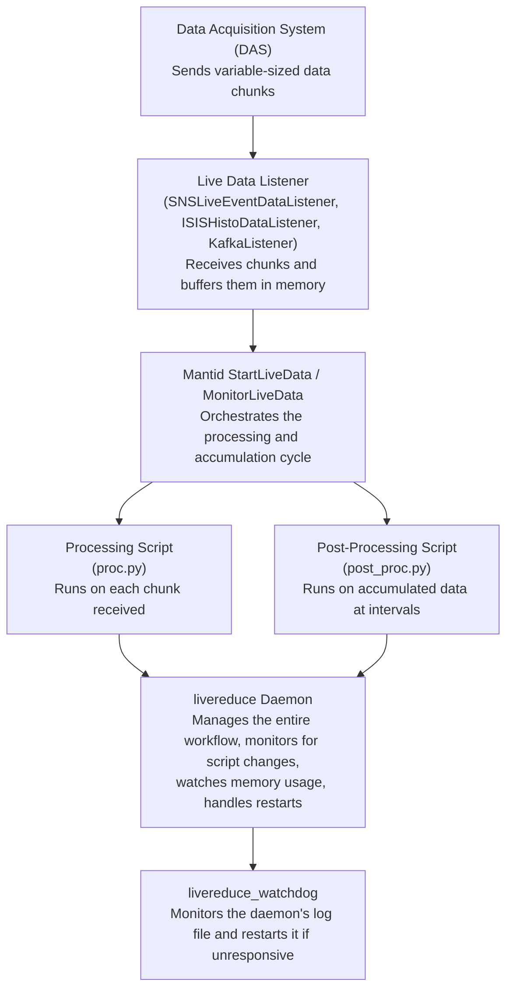

# Architecture

This document describes the design and components of the live reduction system.

## System Components

The live reduction system has several interconnected components:



### Component Descriptions

**DAS (Data Acquisition System)**
- Collects neutron event or histogram data from detectors
- Streams data to registered listeners
- Chunk sizes vary based on event rate and detector activity
- You cannot control chunk size - DAS sends what it has buffered

**Live Data Listener**
- Mantid components that connect to DAS and receive data chunks
- Different listeners support different protocols (TCP, Kafka) and formats (events, histograms)
- Examples: `SNSLiveEventDataListener`, `ISISHistoDataListener`, `KafkaEventListener`

**StartLiveData / MonitorLiveData**
- Mantid algorithms managing the live data workflow
- `StartLiveData`: Initializes connection and processing
- `MonitorLiveData`: Runs in loop, calling processing scripts periodically

**Processing Scripts**
- Python scripts defining data transformations
- `proc.py`: Processes each incoming chunk
- `post_proc.py`: Processes accumulated data
- Instrument-specific and user-written

**livereduce Daemon**
- Systemd service wrapping the entire workflow
- Provides automatic restart on errors
- Monitors memory usage and is a systemd service
- Detects script changes via inotify file watching

**livereduce_watchdog**
- Independent monitoring service
- Checks if main daemon is writing to log file
- Restarts main service if unresponsive

## Data Flow

Understanding data flow is key to effective live reduction:

### 1. DAS Sends Chunks
- DAS transmits data in variable-sized chunks
- Timing and size determined by DAS, not controllable
- Chunk size varies based on event rate and buffering

### 2. Listener Buffers
- Listener accumulates events/histograms into buffer
- Passes to Mantid when threshold or timeout reached
- Buffer size configurable per listener type

### 3. Processing Executes
- If `proc.py` exists, runs on each chunk received
- Processed chunk updates `output` workspace
- Blocks until processing completes

### 4. Accumulation Occurs
Mantid accumulates chunks based on `AccumulationMethod`:
- **Add**: Runs the Plus algorithm on the current output from the proc and the accumulation workspace
  - For histograms: modifies values
  - For events: appends new events to the EventList and grows continuously
- **Replace**: Each chunk replaces previous data (good for histogram monitoring)
- **Append**: Appends spectra into the output workspace, growing the number of spectra

### 5. Post-Processing Executes
- At minimum, `UpdateEvery` seconds (default 30). Will be slower if the "proc" script takes longer than this setting
- If `post_proc.py` exists, runs on `accumulation` workspace
- Blocks chunk processing while running

### 6. Memory Monitoring
- If enabled, daemon checks memory usage periodically
- Restarts the daemon if limits exceeded
- Terminates the daemon before [OOM Killer](https://learn.redhat.com/t5/Platform-Linux/Out-of-Memory-Killer/td-p/48828) does
  - This allows for logging the issue

### 7. Output Generation
- Post-processing typically generates files, plots, web content
- Scientists view results in real-time
- Output location configurable per instrument

## Processing vs Post-Processing

The two-stage model allows you to balance per-chunk operations with accumulated data analysis based on your needs:

### Processing Script (`reduce_<INSTRUMENT>_live_proc.py`)

**Purpose**: operations on each incoming chunk

**When it runs**: After the previous proc step completes or `UpdateEvery` seconds, whichever is slower

**Available workspaces**:
- `input`: The incoming data chunk (workspace)
- `output`: Where to put results (workspace name as string)
  - This is the workspace pointer defined by the variable 'output'
  - This reference/pointer has to be overwritten by your script

**Performance considerations**:
- Data keeps accumulating while script runs (DAS caches events already sent)
- Live reduction waits to rerun until script completes
- Doesn't need to be fast, but faster is better
- Avoid file I/O

**Typical operations**:
- Basic rebinning
- Spectrum summing
- Simple filtering
- Unit conversions
- Detector grouping

**Example**:
```python
from mantid.simpleapi import Rebin, SumSpectra

# Sum all spectra in the chunk
SumSpectra(InputWorkspace=input, OutputWorkspace=output)
# Rebin to coarser bins for faster plotting
Rebin(InputWorkspace=output, OutputWorkspace=output,
      Params="300,20,17000")
```

### Post-Processing Script (`reduce_<INSTRUMENT>_live_post_proc.py`)

**Purpose**: Comprehensive analysis on accumulated data

**When it runs**: After every "proc" step is acculuated

**Available workspaces**:
- `accumulation`: All data accumulated so far
- `output`: Where to put results (workspace name as string)
- Any workspaces created during processing

**Performance considerations**:
- Runs less frequently
- Can be computationally intensive
- File I/O appropriate here

**Typical operations**:
- Background subtraction
- Normalization by measurement time or accumulated proton charge
- Peak fitting
- File writing (NeXus, ASCII, images)
- Web service updates
- Complex calculations

**Example**:
```python
from mantid.simpleapi import SaveAscii, SaveNexus

# Save accumulated data to shared directory
output_dir = "/SNS/INSTR/IPTS-12345/shared/livereduce"
SaveNexus(InputWorkspace="accumulation",
          Filename=f"{output_dir}/live_data.nxs")
SaveAscii(InputWorkspace="accumulation",
          Filename=f"{output_dir}/live_data.txt")
```

## Best Practices

### Script Performance
- Keep processing scripts lightweight
- Put file I/O in post-processing only
- Test with realistic data rates before deploying
- Proc scripts that output EventWorkspace can create very large accumulation workspaces
  - Consider having proc script return a histogram, or histogram early in post-proc

### Memory Management
- Consider event preservation carefully - very memory intensive
- Use `PreserveEvents=False` when possible
- Monitor memory usage in production
- Configure appropriate `system_mem_limit_perc`

### External Integrations
- Use post-processing for external database updates
- Put web service calls in post-processing
- Handle errors gracefully in post-processing scripts

### Testing
- Use fake data servers for development
- Test memory usage under load
- Verify scripts before production deployment

## Related Documentation

- [Developer Guide](developer-guide.md) - Setting up the system
- [Processing Scripts](processing-scripts.md) - Writing and deploying scripts
- [Configuration Reference](configuration.md) - All configuration options

### Mantid Algorithm Documentation
- [StartLiveData](https://docs.mantidproject.org/nightly/algorithms/StartLiveData-v1.html) - Initialize live data connection and processing
- [MonitorLiveData](https://docs.mantidproject.org/nightly/algorithms/MonitorLiveData-v1.html) - Run live data processing loop
- [LoadLiveData](https://docs.mantidproject.org/nightly/algorithms/LoadLiveData-v1.html) - Load live data from a listener
