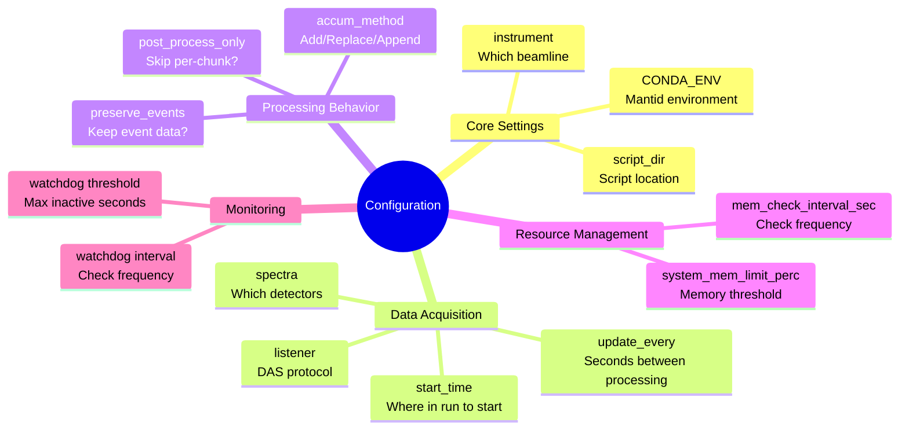

# Configuration Reference

Complete reference for `/etc/livereduce.conf` configuration options.

## Configuration File Format

The configuration file is JSON format:

```json
{
  "instrument": "POWGEN",
  "CONDA_ENV": "mantid-nightly",
  "script_dir": "/SNS/POWGEN/shared/livereduce",
  "update_every": 30,
  "preserve_events": false,
  "accum_method": "Add",
  "periods": [1, 3],
  "spectra": [0, 100, 200],
  "system_mem_limit_perc": 70,
  "mem_check_interval_sec": 1,
  "watchdog": {
    "interval": 60,
    "threshold": 300
  }
}
```

## Configuration Parameters



| Parameter | Type | Default | Description |
|-----------|------|---------|-------------|
| `instrument` | string | From `/etc/mantid.local.properties` | Instrument short name (e.g., "POWGEN") |
| `CONDA_ENV` | string | `"mantid-dev"` | Conda environment containing Mantid |
| `script_dir` | string | `/SNS/{instrument}/shared/livereduce` | Directory containing processing scripts |
| `update_every` | integer | `30` | Seconds between post-processing runs |
| `preserve_events` | boolean | `true` | Keep event data after processing (memory intensive) |
| `accum_method` | string | `"Add"` | How to accumulate chunks: "Add", "Replace", or "Append" |
| `periods` | array | `null` | ISIS-specific: which periods to load (e.g., `[1,3]`) |
| `spectra` | array | `null` | Which spectra to load (e.g., `[0,100,200]`) |
| `system_mem_limit_perc` | integer | `70` | Restart if memory exceeds this % of total RAM (0=disabled) |
| `mem_check_interval_sec` | integer | `1` | How often to check memory usage |
| `watchdog.interval` | integer | `60` | Seconds between watchdog checks |
| `watchdog.threshold` | integer | `300` | Restart main service if log unchanged for this many seconds (min 20) |

## Parameter Details

### instrument

**Type**: string
**Default**: From `/etc/mantid.local.properties`
**Required**: No (but strongly recommended)

The instrument short name. Used to:
- Set Mantid's default instrument
- Determine default `script_dir` location
- Find facility information

**Examples**:
```json
{"instrument": "POWGEN"}
{"instrument": "REF_M"}
{"instrument": "NOMAD"}
{"instrument": "ISIS_Histogram"}
```

**Note**: If not specified, livereduce queries Mantid's ConfigService for the default instrument.

### CONDA_ENV

**Type**: string
**Default**: `"mantid-dev"`
**Required**: No

The conda environment containing Mantid. The service wrapper script (`livereduce.sh`) activates this environment before running the daemon.

**Examples**:
```json
{"CONDA_ENV": "mantid-nightly"}
{"CONDA_ENV": "mantid-production"}
{"CONDA_ENV": "mantid-6.10"}
```

**Note**: Environment must exist and contain Mantid installation.

### script_dir

**Type**: string
**Default**: `/SNS/{instrument}/shared/livereduce`
**Required**: No

Directory containing processing scripts. Scripts must be named:
- `reduce_{instrument}_live_proc.py`
- `reduce_{instrument}_live_post_proc.py`

**Examples**:
```json
{"script_dir": "/SNS/POWGEN/shared/livereduce"}
{"script_dir": "/home/user/test_scripts"}
{"script_dir": "/custom/location"}
```

### update_every

**Type**: integer
**Default**: `30`
**Required**: No
**Units**: seconds

How often post-processing runs. Passed to Mantid's `StartLiveData` as `UpdateEvery` parameter.

**Trade-offs**:
- Smaller values = more responsive, higher CPU usage
- Larger values = less overhead, slower updates

**Examples**:
```json
{"update_every": 10}   // Fast updates
{"update_every": 30}   // Default
{"update_every": 60}   // Slow updates
```

**Note**: Does not control chunk arrival rate (DAS controls that).

### preserve_events

**Type**: boolean
**Default**: `true`
**Required**: No

Whether to keep event data after processing. When `true`, events are preserved in memory (allows further event-mode processing). When `false`, data is converted to histograms (much less memory).

**Examples**:
```json
{"preserve_events": false}  // Recommended for most cases
{"preserve_events": true}   // Only if you need event data
```

**Warning**: Setting `true` can lead to rapid memory growth!

### accum_method

**Type**: string
**Default**: `"Add"`
**Required**: No
**Valid values**: `"Add"`, `"Replace"`, `"Append"`

How to accumulate chunks.

**Add** (default):
- Sums chunks together
- Use for: Event data, normal accumulation
- Result: All data combined

**Replace**:
- Each chunk replaces previous
- Use for: Histogram monitoring, only want latest data
- Result: Only most recent chunk shown

**Append**:
- Stack chunks as separate spectra
- Use for: Time-series analysis
- Result: Workspace grows with each chunk

**Examples**:
```json
{"accum_method": "Add"}
{"accum_method": "Replace"}
{"accum_method": "Append"}
```

### periods

**Type**: array of integers
**Default**: `null` (all periods)
**Required**: No
**ISIS-specific**

Which periods to load for ISIS multi-period data.

**Examples**:
```json
{"periods": [1, 3]}        // Load periods 1 and 3
{"periods": [1, 2, 3, 4]}  // Load periods 1-4
```

**Note**: Only applies to ISIS instruments with multi-period data.

### spectra

**Type**: array of integers
**Default**: `null` (all spectra)
**Required**: No

Which spectra (detector IDs) to load. Reduces memory by loading subset.

**Examples**:
```json
{"spectra": [0, 100, 200]}  // Load 3 specific spectra
{"spectra": [1, 2, 3, 4, 5]} // Load first 5 spectra
```

**Note**: Useful for monitoring specific detectors or reducing memory usage.

### system_mem_limit_perc

**Type**: integer
**Default**: `70`
**Required**: No
**Units**: percentage
**Range**: 0-100 (0 disables monitoring)

Restart processing if memory usage exceeds this percentage of total system RAM.

**Examples**:
```json
{"system_mem_limit_perc": 70}  // Restart at 70%
{"system_mem_limit_perc": 80}  // Allow more memory
{"system_mem_limit_perc": 0}   // Disable monitoring
```

**Note**: Prevents system crashes from memory exhaustion.

### mem_check_interval_sec

**Type**: integer
**Default**: `1`
**Required**: No
**Units**: seconds

How often to check memory usage.

**Examples**:
```json
{"mem_check_interval_sec": 1}  // Check every second
{"mem_check_interval_sec": 5}  // Check every 5 seconds
```

**Note**: More frequent checks catch memory issues faster but use slightly more CPU.

### watchdog.interval

**Type**: integer
**Default**: `60`
**Required**: No
**Units**: seconds

How often the watchdog checks the main service log file.

**Examples**:
```json
{"watchdog": {"interval": 60}}   // Check every minute
{"watchdog": {"interval": 120}}  // Check every 2 minutes
```

### watchdog.threshold

**Type**: integer
**Default**: `300`
**Required**: No
**Units**: seconds
**Minimum**: 20

Maximum allowed time without log activity before watchdog restarts main service.

**Examples**:
```json
{"watchdog": {"threshold": 300}}  // Restart after 5 min
{"watchdog": {"threshold": 600}}  // Restart after 10 min
```

**Note**: Must be at least 20 seconds (time needed to restart service).

## Example Configurations

### Event-Based Instrument (High Memory)

```json
{
  "instrument": "ARCS",
  "CONDA_ENV": "mantid-nightly",
  "update_every": 30,
  "preserve_events": false,
  "accum_method": "Add",
  "system_mem_limit_perc": 75,
  "mem_check_interval_sec": 2
}
```

### Histogram Instrument (Fast Updates)

```json
{
  "instrument": "POWGEN",
  "CONDA_ENV": "mantid-production",
  "update_every": 10,
  "accum_method": "Replace",
  "preserve_events": false
}
```

### ISIS Multi-Period Instrument

```json
{
  "instrument": "ISIS_Histogram",
  "CONDA_ENV": "mantid",
  "periods": [1, 2, 3],
  "spectra": [10, 20, 30, 40],
  "accum_method": "Add",
  "update_every": 30
}
```

### Memory-Constrained System

```json
{
  "instrument": "NOMAD",
  "CONDA_ENV": "mantid-nightly",
  "preserve_events": false,
  "accum_method": "Replace",
  "system_mem_limit_perc": 60,
  "mem_check_interval_sec": 1,
  "spectra": [0, 100, 200, 300, 400]
}
```

### Development/Testing

```json
{
  "instrument": "ISIS_Histogram",
  "script_dir": "test",
  "update_every": 3,
  "CONDA_ENV": "livereduce",
  "accum_method": "Replace",
  "periods": [1, 3]
}
```

## Validation

### JSON Syntax

Validate JSON syntax:
```bash
cat /etc/livereduce.conf | jq .
```

If valid, prints formatted JSON. If invalid, shows error.

### Configuration Reload

Modifying `/etc/livereduce.conf` causes the service to exit. Systemd automatically restarts it with new configuration:

```bash
# Edit config
sudo vim /etc/livereduce.conf

# Service will restart automatically
# Monitor logs
tail -f /var/log/SNS_applications/livereduce.log
```

## Related Documentation

- [Developer Guide](developer-guide.md) - Setting up the system
- [Processing Scripts](processing-scripts.md) - Script-specific settings
- [Architecture](architecture.md) - How configuration affects behavior
- [Troubleshooting](troubleshooting.md) - Configuration problems
