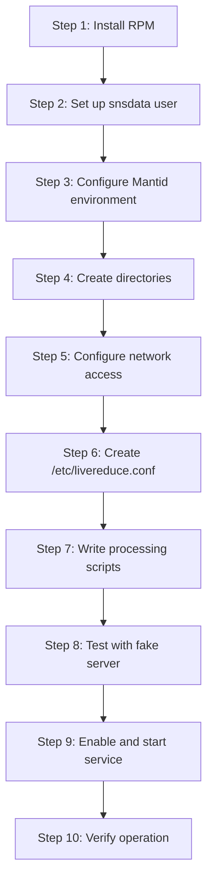

# Developer Guide

This guide walks through setting up live reduction on a dedicated server for automated, daemon-based processing.

## Prerequisites

- Linux server with systemd (RHEL 8+, Ubuntu, etc.)
- Network access to instrument DAS
- `snsdata` user account (or equivalent service account)
- Sudo/admin access for installation and configuration

## Installation Steps



### 1. Install the livereduce RPM

For SNS systems using DNF:
```bash
sudo dnf install python-livereduce
```

Or manually from a built RPM:
```bash
sudo rpm -ivh python-livereduce-1.17-1.noarch.rpm
```

This installs:
- `/usr/bin/livereduce.sh` - Service wrapper script
- `/usr/bin/livereduce.py` - Main daemon
- `/usr/lib/systemd/system/livereduce.service` - Systemd unit file

### 2. Create the snsdata user (if not exists)

```bash
# The RPM's %pre script will warn if this user doesn't exist
sudo useradd -r -g users -G hfiradmin snsdata
```

### 3. Configure Mantid

Create or edit `/etc/mantid.local.properties`:
```properties
default.facility=SNS
default.instrument=POWGEN
```

### 4. Create the configuration file

Create `/etc/livereduce.conf` with minimal configuration:
```json
{
  "instrument": "POWGEN",
  "CONDA_ENV": "mantid-nightly"
}
```

See [Configuration Reference](configuration.md) for all options.

### 5. Set up conda environment

Ensure the specified conda environment exists and has Mantid:
```bash
# As the user who will run the service
conda create -n mantid-nightly
conda activate mantid-nightly
conda install -c mantid mantid
```

### 6. Create script directory

```bash
# Default location for SNS instruments
sudo mkdir -p /SNS/POWGEN/shared/livereduce
sudo chown snsdata:users /SNS/POWGEN/shared/livereduce
sudo chmod 775 /SNS/POWGEN/shared/livereduce
```

### 7. Install processing scripts

Copy your instrument-specific scripts:
```bash
cp reduce_POWGEN_live_proc.py /SNS/POWGEN/shared/livereduce/
cp reduce_POWGEN_live_post_proc.py /SNS/POWGEN/shared/livereduce/
```

See [Processing Scripts](processing-scripts.md) for how to write these.

### 8. Enable and start the service

```bash
sudo systemctl enable livereduce
sudo systemctl start livereduce
```

### 9. Verify it's running

```bash
systemctl status livereduce
tail -f /var/log/SNS_applications/livereduce.log
```

Look for:
- "StartLiveData" with configuration details
- Connection messages
- Processing script detection

### 10. Optional: Enable watchdog

The watchdog monitors the main service and restarts it if unresponsive:
```bash
sudo dnf install python-livereduce-watchdog
sudo systemctl enable livereduce_watchdog
sudo systemctl start livereduce_watchdog
```

## Network Requirements

The server must be able to connect to:

**Required**:
- Instrument DAS (typically `bl<N>a-dassrv1.sns.gov` at SNS)
- Shared file systems (for writing output files)

**Optional** (depending on post-processing):
- Web services (if publishing results)
- Databases (if storing metadata)
- Kafka brokers (if using Kafka listeners)

### Firewall Configuration

Depending on listener type, you may need to adjust firewall rules:

**TCP listeners**:
```bash
# Allow incoming connections on listener port
sudo firewall-cmd --add-port=31415/tcp --permanent
sudo firewall-cmd --reload
```

**Kafka listeners**:
```bash
# Allow connections to Kafka brokers (ports 9092, 9093, etc.)
sudo firewall-cmd --add-rich-rule='rule family="ipv4" source address="kafka-broker.facility.gov" accept' --permanent
sudo firewall-cmd --reload
```

## Deployment Workflow

### Updating Processing Scripts

The daemon automatically detects script changes via inotify:

**1. Test scripts locally** (see [Processing Scripts](processing-scripts.md))

**2. Copy to production**:
```bash
scp reduce_INSTR_live_proc.py snsdata@beamline-server:/SNS/INSTR/shared/livereduce/
scp reduce_INSTR_live_post_proc.py snsdata@beamline-server:/SNS/INSTR/shared/livereduce/
```

**3. Automatic detection**:
The daemon uses inotify to watch for file changes:
- Script modified (md5sum changed): Restarts processing automatically
- Script deleted: Restarts without that script
- Script created: Restarts with new script

**4. Verify deployment**:
```bash
# Check the log for restart message
sudo journalctl -u livereduce -n 50

# Look for:
# "Processing script "/path/to/script" changed - restarting StartLiveData"
```

**5. Monitor for errors**:
```bash
tail -f /var/log/SNS_applications/livereduce.log
```

### Updating Configuration

**Note**: Modifying `/etc/livereduce.conf` causes the service to exit. Systemd will restart it with the new configuration after a short delay.

```bash
# 1. Edit configuration
sudo vim /etc/livereduce.conf

# 2. Service will automatically restart
# Monitor logs to verify
tail -f /var/log/SNS_applications/livereduce.log
```

## Managing the Service

### Basic Commands

```bash
# Start the service
sudo systemctl start livereduce

# Stop the service
sudo systemctl stop livereduce

# Restart the service
sudo systemctl restart livereduce

# Check status
systemctl status livereduce
sudo systemctl status livereduce  # Shows more log lines

# Enable at boot
sudo systemctl enable livereduce

# Disable at boot
sudo systemctl disable livereduce
```

### Viewing Logs

```bash
# Service log file (readable by anyone)
tail -f /var/log/SNS_applications/livereduce.log

# Systemd journal (requires sudo for full history)
sudo journalctl -u livereduce -f

# Last 100 lines
sudo journalctl -u livereduce -n 100

# Since specific time
sudo journalctl -u livereduce --since "2026-01-21 10:00:00"
```

### Checking Service Health

```bash
# Quick status check
systemctl status livereduce

# See all processes owned by snsdata
ps -u snsdata -o pid,etime,stat,command

# Process tree
pstree -p $(pgrep -f livereduce.py)

# Files the process has open
sudo lsof -p $(pgrep -f livereduce.py)
```

## Watchdog Service

The watchdog is a separate, independent service that monitors the main daemon.

### How It Works

1. Checks `/var/log/SNS_applications/livereduce.log` modification time
2. If no updates for `threshold` seconds (default 300), restarts main service
3. Logs the last 20 lines of main log before restarting
4. Prevents repeated restarts within same inactivity window

### Managing Watchdog

```bash
# Watchdog operations are completely independent
sudo systemctl start livereduce_watchdog
sudo systemctl stop livereduce_watchdog
sudo systemctl restart livereduce_watchdog
systemctl status livereduce_watchdog
```

**Important**:
- Stopping watchdog doesn't affect main service
- Main service continues running unsupervised
- Watchdog and main service must be managed separately

### Watchdog Configuration

Configure in `/etc/livereduce.conf`:
```json
{
  "watchdog": {
    "interval": 60,      # Check every 60 seconds
    "threshold": 300     # Restart if no activity for 300 seconds
  }
}
```

### Watchdog Logs

```bash
# View watchdog log
tail -f /var/log/SNS_applications/livereduce_watchdog.log

# Watchdog journal
sudo journalctl -u livereduce_watchdog -f
```

### When to Use Watchdog

**Enable for**:
- Production operation
- Unattended running
- Known issues with service stalling
- Automatic recovery from hangs

**Disable for**:
- Maintenance on main service
- Testing script changes interactively
- Investigating why restarts happen
- Watchdog too aggressive for workload

## Production Checklist

Before deploying to production:

- [ ] Tested processing scripts with fake data server
- [ ] Verified scripts with realistic data rates
- [ ] Checked memory usage under load
- [ ] Configured appropriate `system_mem_limit_perc`
- [ ] Network connectivity to DAS verified
- [ ] Output directory permissions correct
- [ ] Log rotation configured
- [ ] Watchdog enabled and configured
- [ ] Service enabled at boot
- [ ] Monitoring/alerting set up
- [ ] Documentation for instrument scientists

## Related Documentation

- [Architecture](architecture.md) - System design and components
- [Processing Scripts](processing-scripts.md) - Writing processing scripts
- [Configuration Reference](configuration.md) - All configuration options
- [Troubleshooting](troubleshooting.md) - Fixing problems
