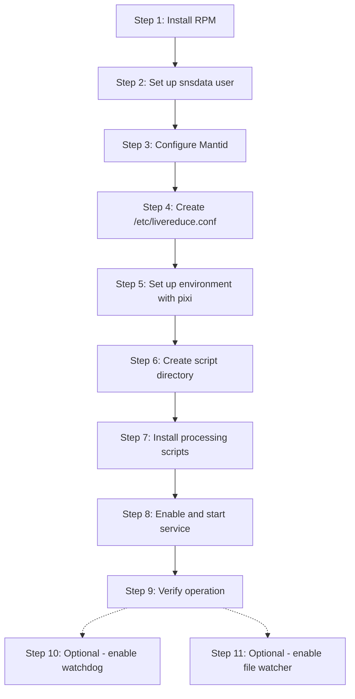

# Developer Guide

This guide walks through setting up live reduction on a dedicated server for automated, daemon-based processing.

## Prerequisites

- Linux server with systemd (RHEL 9+, Ubuntu, etc.)
- Network access to instrument DAS
- `snsdata` user account (or equivalent service account) with access to files that are used in the proc and post-proc scripts
- Sudo/admin access for installation, configuration, and interaction with the systemd services

## Installation Steps


```mermaid
flowchart TD
    Step1["Step 1: Install RPM"]
    Step2["Step 2: Set up snsdata user"]
    Step3["Step 3: Configure Mantid"]
    Step4["Step 4: Create /etc/livereduce.conf"]
    Step5["Step 5: Set up environment with pixi"]
    Step6["Step 6: Create script directory"]
    Step7["Step 7: Install processing scripts"]
    Step8["Step 8: Enable and start service"]
    Step9["Step 9: Verify operation"]
    Step10["Step 10: Optional - enable watchdog"]
    Step11["Step 11: Optional - enable file watcher"]

    Step1 --> Step2
    Step2 --> Step3
    Step3 --> Step4
    Step4 --> Step5
    Step5 --> Step6
    Step6 --> Step7
    Step7 --> Step8
    Step8 --> Step9
    Step9 -.-> Step10
    Step9 -.-> Step11
```

### 1. Install the livereduce RPM

For SNS systems using DNF:
```bash
sudo dnf install python-livereduce
```

Or manually from a built RPM:
```bash
sudo rpm -ivh python-livereduce-1.17-1.noarch.rpm
```

This installs:
- `/usr/bin/livereduce.sh` - Service wrapper script
- `/usr/bin/livereduce.py` - Main daemon
- `/usr/lib/systemd/system/livereduce.service` - Systemd unit file
- `/usr/bin/livereduce_filewatch.sh` - File watcher service script
- `/usr/lib/systemd/system/livereduce_filewatch.service` - File watcher systemd unit file

The watchdog is a separate package, see [step 10](#10-optional-enable-watchdog).

### 2. Create the snsdata user (if not exists)

```bash
# The RPM's %pre script will warn if this user doesn't exist
sudo useradd -r -g users -G hfiradmin snsdata
```

### 3. Configure Mantid

Create or edit `/etc/mantid.local.properties` (optional if `instrument` is defined in `/etc/livereduce.conf`):
```properties
default.facility=SNS
default.instrument=POWGEN
```

### 4. Create the configuration file

Create `/etc/livereduce.conf` with minimal configuration:
```json
{
  "instrument": "POWGEN",
  "CONDA_ENV": "mantid"
}
```

See [Configuration Reference](configuration.md) for all options.

### 5. Set up environment with pixi

The service uses pixi to manage the Mantid environment. Ensure pixi is installed and the environment is configured:
```bash
# Install pixi if not already installed
curl -fsSL https://pixi.sh/install.sh | bash

# The livereduce.sh script will use pixi to run Mantid
# Verify pixi is available
which pixi
```

The `CONDA_ENV` setting in `/etc/livereduce.conf` specifies which Mantid environment to use (typically `mantid` for stable or `mantid-nightly` for development).

### 6. Create script directory

The default location uses Mantid's short name for the instrument, e.g. `PG3` for `POWGEN`:
```bash
# Default location for SNS instruments
sudo mkdir -p /SNS/PG3/shared/livereduce
sudo chown snsdata:users /SNS/PG3/shared/livereduce
sudo chmod 775 /SNS/PG3/shared/livereduce
```

### 7. Install processing scripts

Copy your instrument-specific scripts, which are also named with the short name:
```bash
cp reduce_PG3_live_proc.py /SNS/PG3/shared/livereduce/
cp reduce_PG3_live_post_proc.py /SNS/PG3/shared/livereduce/
```

See [Processing Scripts](processing-scripts.md) for how to write these.

### 8. Enable and start the service

```bash
sudo systemctl enable livereduce
sudo systemctl start livereduce
```

### 9. Verify it's running

```bash
systemctl status livereduce
tail -f /var/log/SNS_applications/livereduce.log
```

Look for:
- "StartLiveData" with configuration details
- Connection messages
- Which processing scripts were loaded ("Using ProcessingScriptFilename ...")

### 10. Optional: Enable watchdog

The watchdog monitors the main service and restarts it if unresponsive. It is a separate package,
which installs `/usr/bin/livereduce_watchdog.sh`, `/usr/lib/systemd/system/livereduce_watchdog.service`,
and a polkit rule that lets `snsdata` start, stop and restart `livereduce.service`:
```bash
sudo dnf install python-livereduce-watchdog
sudo systemctl enable livereduce_watchdog
sudo systemctl start livereduce_watchdog
```

### 11. Optional: Enable file watcher

The file watcher applies configuration and processing script changes without a manual restart.
It is installed with `python-livereduce`, but not enabled:
```bash
sudo systemctl enable livereduce_filewatch
sudo systemctl start livereduce_filewatch
```

## Network Requirements

The server must be able to connect to:

**Required**:
- Instrument DAS (typically `bl<N>a-dassrv1.sns.gov` at SNS)
- Shared file systems (for writing output files)

**Optional** (depending on post-processing):
- Web services (if publishing results)
- Databases (if storing metadata)
- Kafka brokers (if using Kafka listeners)

### Firewall Configuration

Depending on listener type, you may need to adjust firewall rules:

**TCP listeners**:
```bash
# Allow incoming connections on listener port
sudo firewall-cmd --add-port=31415/tcp --permanent
sudo firewall-cmd --reload
```

**Kafka listeners**:
```bash
# Allow connections to Kafka brokers (ports 9092, 9093, etc.)
sudo firewall-cmd --add-rich-rule='rule family="ipv4" source address="kafka-broker.facility.gov" accept' --permanent
sudo firewall-cmd --reload
```

## Deployment Workflow

### Updating Processing Scripts

The daemon loads the processing scripts at startup. If `livereduce_filewatch` is running, it
detects script changes automatically; otherwise the daemon must be restarted for an edit to take effect:

**1. Test scripts locally** (see [Processing Scripts](processing-scripts.md))

**2. Copy to production**:
```bash
scp reduce_INSTR_live_proc.py snsdata@beamline-server:/SNS/INSTR/shared/livereduce/
scp reduce_INSTR_live_post_proc.py snsdata@beamline-server:/SNS/INSTR/shared/livereduce/
```

**3. Automatic detection or restart**:
With `livereduce_filewatch` running, the file watcher uses inotify to watch for file changes:
- Script modified (md5sum changed): Reloads the scripts and restarts processing automatically
- Script deleted: Reloads without that script
- Script created: Reloads with new script

Without it, adding, modifying or deleting a script has no effect until the service is restarted:
```bash
sudo systemctl restart livereduce
```

**4. Verify deployment**:
```bash
# Check the service came back up
systemctl status livereduce
sudo journalctl -u livereduce -n 50

# With the file watcher, check it saw the change:
tail /var/log/SNS_applications/livereduce_filewatch.log
# "Processing script '/path/to/script' changed (CLOSE_WRITE,CLOSE)"
# "sent SIGHUP to livereduce.py"

# Look for the scripts the daemon loaded:
# "Reloading processing scripts" (file watcher only)
# "Using ProcessingScriptFilename '/path/to/script'"
# "Using PostProcessingScriptFilename '/path/to/script'"
```

**5. Monitor for errors**:
```bash
tail -f /var/log/SNS_applications/livereduce.log
```

### Updating Configuration

**Note**: `/etc/livereduce.conf` is read only at startup. With `livereduce_filewatch` running,
modifying it causes the service to exit, and systemd will restart it with the new configuration
after a short delay. Otherwise, the daemon must be restarted manually to apply the new configuration.

```bash
# 1. Edit configuration
sudo vim /etc/livereduce.conf

# 2. Without livereduce_filewatch, restart to apply it
sudo systemctl restart livereduce

# 3. Monitor logs to verify
tail -f /var/log/SNS_applications/livereduce.log
```

## Managing the Service

### Basic Commands

```bash
# Start the service
sudo systemctl start livereduce

# Stop the service
sudo systemctl stop livereduce

# Restart the service
sudo systemctl restart livereduce

# Check status
systemctl status livereduce
sudo systemctl status livereduce  # Shows more log lines

# Enable at boot
sudo systemctl enable livereduce

# Disable at boot
sudo systemctl disable livereduce
```

### Viewing Logs

```bash
# Service log file (readable by anyone)
tail -f /var/log/SNS_applications/livereduce.log

# Systemd journal (requires sudo for full history)
sudo journalctl -u livereduce -f

# Last 100 lines
sudo journalctl -u livereduce -n 100

# Since specific time
sudo journalctl -u livereduce --since "2026-01-21 10:00:00"
```

### Checking Service Health

```bash
# Quick status check
systemctl status livereduce

# See all processes owned by snsdata
ps -u snsdata -o pid,etime,stat,command

# Process tree
pstree -p $(pgrep -f livereduce.py)

# Files the process has open
sudo lsof -p $(pgrep -f livereduce.py)
```

## Watchdog Service

The watchdog is a separate, independent service that monitors the main daemon.

### How It Works

1. Checks `/var/log/SNS_applications/livereduce.log` modification time
2. If no updates for `threshold` seconds (default 300), restarts main service
3. Logs the last 20 lines of main log before restarting
4. Prevents repeated restarts within same inactivity window

### Managing Watchdog

```bash
# Watchdog operations are completely independent
sudo systemctl start livereduce_watchdog
sudo systemctl stop livereduce_watchdog
sudo systemctl restart livereduce_watchdog
systemctl status livereduce_watchdog
```

**Important**:
- Stopping watchdog doesn't affect main service
- Main service continues running unsupervised
- Watchdog and main service must be managed separately

### Watchdog Configuration

Configure in `/etc/livereduce.conf`:
```json
{
  "watchdog": {
    "interval": 60,      # Check every 60 seconds
    "threshold": 300     # Restart if no activity for 300 seconds
  }
}
```

### Watchdog Logs

```bash
# View watchdog log
tail -f /var/log/SNS_applications/livereduce_watchdog.log

# Watchdog journal
sudo journalctl -u livereduce_watchdog -f
```

### When to Use Watchdog

**Enable for**:
- Production operation
- Unattended running
- Known issues with service stalling
- Automatic recovery from hangs

**Disable for**:
- Maintenance on main service
- Testing script changes interactively
- Investigating why restarts happen
- Watchdog too aggressive for workload

## File Watcher Service

The file watcher is a separate, optional service that applies configuration and processing script
changes to the running daemon. See [Service Behavior](#service-behavior) for the details.

### How It Works

1. Reads the configuration and script paths the daemon publishes in `/run/livereduce/scripts.json`,
   with the md5sum of each file as the daemon loaded it
2. Watches those files with `inotifywait`; a symlinked file is also watched through its target
3. Waits until events stop for a second, so a save made of several steps (e.g. vim renaming the old
   file away first) acts once on the finished file
4. Compares md5sums with what the daemon loaded, ignoring events that change nothing, such as a bare `touch`.
   This also catches changes made before the watcher started
5. Script changed: sends `SIGHUP`, and the daemon reloads the scripts in the same process
6. Configuration changed: sends `SIGTERM`, and systemd restarts the daemon with the new configuration

### Managing File Watcher

```bash
# File watcher operations are completely independent
sudo systemctl start livereduce_filewatch
sudo systemctl stop livereduce_filewatch
sudo systemctl restart livereduce_filewatch
systemctl status livereduce_filewatch
```

**Important**:
- Stopping the file watcher doesn't affect main service
- Without it, changes need `sudo systemctl restart livereduce`
- Only edits made on the server itself are detected; inotify doesn't see changes made on another
  host through a network filesystem

### File Watcher Logs

```bash
# View file watcher log - one entry per change acted on
tail -f /var/log/SNS_applications/livereduce_filewatch.log

# File watcher journal - which files are being watched
sudo journalctl -u livereduce_filewatch -f
```

### When to Use File Watcher

**Enable for**:
- Frequent script updates
- Deploying scripts unattended, e.g. from version control
- Reloading scripts without restarting the daemon

**Disable for**:
- Editing scripts in several steps, where each save would reload
- Controlling exactly when changes take effect
- Investigating why reloads or restarts happen

## Production Checklist

Before deploying to production:

- [ ] Tested processing scripts with fake data server
- [ ] Verified scripts with realistic data rates
- [ ] Checked memory usage under load
- [ ] Configured appropriate `system_mem_limit_perc`
- [ ] Network connectivity to DAS verified
- [ ] Output directory permissions correct
- [ ] Log rotation configured
- [ ] Watchdog enabled and configured
- [ ] File watcher enabled, if changes should apply automatically
- [ ] Service enabled at boot
- [ ] Monitoring/alerting set up
- [ ] Documentation for instrument scientists

## Service Behavior

The daemon reads the configuration file and processing scripts only at startup. Changes are
detected by the separate `livereduce_filewatch` service (installed with `python-livereduce`),
which uses `inotifywait` and compares md5sums so that only real content changes act. It signals
the daemon directly rather than going through `systemctl`, since both run as `snsdata`.

The script paths depend on mantid's short instrument name (e.g. `POWGEN` becomes `PG3`), so the
file watcher doesn't work them out itself. Whenever the daemon resolves them (at startup and on
every reload) it writes them to `/run/livereduce/scripts.json`, along with the configuration file it
read and the md5sum of each file as loaded, and the file watcher watches the files named there.
Starting from those md5sums rather than the files on disk means an edit made while the file watcher
was restarting is still acted on. `/run/livereduce` is created by `livereduce.service` and kept until reboot.

When one of the processing scripts is changed, added, or removed, the file watcher sends `SIGHUP`.
The daemon then cancels [StartLiveData](https://docs.mantidproject.org/nightly/algorithms/StartLiveData-v1.html) and [MonitorLiveData](https://docs.mantidproject.org/nightly/algorithms/MonitorLiveData-v1.html),
clears its workspaces, and restarts them in the same process. This is to be resilient against
changes in the scripts. If the reload fails (e.g. neither script exists any more), the daemon
exits with an error and systemd restarts it.

When the configuration file is changed, the file watcher sends `SIGTERM`, so the process exits and
systemd restarts it. This is done in case the version of mantid wanted is changed. If the
restarted daemon publishes different script paths, the file watcher exits too, and systemd
restarts it so it watches the new files.

Without `livereduce_filewatch` running, changes take effect only after
`sudo systemctl restart livereduce`.

## Building and Deploying a New Version of the Software

### Release a New Version

This project follows semantic versioning. Version numbers are in the format `MAJOR.MINOR`.
To create a new version, start by updating the `version` field in `pyproject.toml`.
For example, to create version `1.20`:
```toml
[project]
version = "1.20"
```

Then we create a git tag and release with the same version number. This can be done with the GitHub CLI tool `gh`:
```bash
git checkout main
git fetch --all --prune
git fetch --prune --prune-tags origin
git rebase -v origin/main
gh release create v1.20 --title "v1.20" --target main --generate-notes
```
Command `gh release create` creates both the tag `v1.20` and a GitHub release accessible at
https://github.com/mantidproject/livereduce/releases/tag/v1.20

### Building the RPM

This package uses a hand-written spec file for releasing on RPM based systems.
To build, run script `rpmbuid.sh` in an environment containing the RPM building framework.
Host `ndav.sns.gov` has all necessary dependencies.

```bash
./rpmbuild.sh
```

Packages generated by this script:

- `$HOME/rpmbuild/RPMS/noarch/python-livereduce-<version>-1.el9.noarch.rpm `
- `$HOME/rpmbuild/RPMS/noarch/python-livereduce-watchdog-<version>-1.el9.noarch.rpm`
- `$HOME/rpmbuild/SRPMS/python-livereduce-<version>-1.el9.src.rpm`

The source package `src.rpm` contains both `livereduce` and `livereduce-watchdog` services.
The `livereduce_filewatch` service is part of `python-livereduce`.

The last step requires manually uploading these packages to the GitHub release page created in the previous step.
You will need to edit the release page and click on `Attach binaries by dropping them here or selecting them`
in order to upload the three files.
After that, notify Peter Peterson who will copy these files onto `snspackages.ornl.gov`
for distribution on SNS systems.

Note: For RPM development and testing, visit the [RPM testing guide](../test/rpm/README.md).

### Developer Setup

This repository is configured to use pre-commit. Set up with pixi:

```bash
pixi install
pixi shell
pre-commit install
```

More information about testing can be found in [test/README.md](../test/README.md).

## Contributing to Development

### Prerequisites for Development

- Linux system (tested on Fedora/RHEL/CentOS)
- Python 3.9 or later
- [Pixi](https://pixi.sh/) for environment management
- Git for version control

### Setting Up Your Development Environment

1. **Fork and clone the repository:**

```bash
git clone https://github.com/YOUR_USERNAME/livereduce.git
cd livereduce
```

2. **Set up development environment:**

```bash
pixi install
pixi shell
```

This installs:
- Mantid framework
- Python dependencies (psutil)
- Development tools (pre-commit, hatchling)

3. **Install pre-commit hooks:**

```bash
pre-commit install
```

Pre-commit runs linting and formatting checks before each commit.

## Development Workflow

### Making Changes

1. **Create a feature branch:**

```bash
git checkout -b feature/your-feature-name
```

Use descriptive branch names:
- `feature/add-kafka-listener`
- `fix/memory-leak-in-monitor`
- `docs/update-configuration-guide`

2. **Make your changes** following the code style guidelines below.

3. **Test your changes** (see Testing section).

4. **Commit with clear messages:**

```bash
git add .
git commit -m "Add support for Kafka event streaming

- Implement KafkaListener class
- Add configuration options for broker URLs
- Update documentation with Kafka examples"
```

Good commit messages:
- Start with a verb (Add, Fix, Update, Remove)
- Use present tense
- Include "why" context in the body
- Reference issues when applicable

### Code Style

The project uses automated formatting tools:

- **Ruff** for Python linting and formatting
- **Pre-commit** for automated checks

Configuration is in `ruff.toml` and `.pre-commit-config.yaml`.

**Run checks manually:**

```bash
# Run all pre-commit checks
pre-commit run --all-files

# Run ruff directly
pixi run ruff check scripts/ test/
pixi run ruff format scripts/ test/
```

**Python style guidelines:**

- Follow PEP 8
- Use type hints where reasonable
- Keep functions focused and testable
- Add docstrings for public APIs
- Use meaningful variable names

### Submitting Changes

1. **Push your branch:**

```bash
git push origin feature/your-feature-name
```

2. **Create a Pull Request:**

- Go to https://github.com/mantidproject/livereduce
- Click "New Pull Request"
- Select your fork and branch
- Fill out the PR description with:
  - Summary of changes and motivation
  - Type of change (bug fix, feature, etc.)
  - Testing performed
  - Related issues

3. **Respond to review feedback:**

- Address all reviewer comments
- Push additional commits to the same branch
- Request re-review when ready

## Areas for Contribution

### High-Priority Areas

**1. Additional Data Listeners**

Implement support for new data acquisition systems.

**2. Memory Management Improvements**

Enhance memory monitoring and recovery:
- Better prediction of memory needs
- Smarter workspace cleanup
- Event data compression strategies

**3. Error Recovery**

Improve resilience to transient failures:
- Automatic reconnection to DAS
- Better handling of network interruptions
- Recovery from corrupted data chunks

**4. Performance Optimization**

Profile and optimize hot paths:
- Reduce latency between chunks
- Optimize workspace operations
- Minimize memory allocations

### Documentation Improvements

Always welcome:
- Fix typos or unclear explanations
- Add examples for specific instruments
- Improve troubleshooting guides
- Add diagrams or visualizations

### Bug Reports

Found a bug? Please report it with:

1. **Description:** What happened vs. what you expected
2. **Steps to reproduce:** Exact sequence to trigger the bug
3. **Environment:** OS, Mantid version, LiveReduce version, configuration
4. **Logs:** Relevant log excerpts
5. **Impact:** How severe is the issue?

## Release Process

(For maintainers)

1. **Update version** in `pyproject.toml`
2. **Update changelog** with notable changes
3. **Tag release:**
   ```bash
   git tag -a v1.18 -m "Release version 1.18"
   git push origin v1.18
   ```
4. **CI builds and tests** automatically
5. **Build RPM** for distribution:
   ```bash
   ./rpmbuild.sh
   ```

## Related Documentation

- [Architecture](architecture.md) - System design and components
- [Processing Scripts](processing-scripts.md) - Writing processing scripts
- [Configuration Reference](configuration.md) - All configuration options
- [Troubleshooting](troubleshooting.md) - Fixing problems
