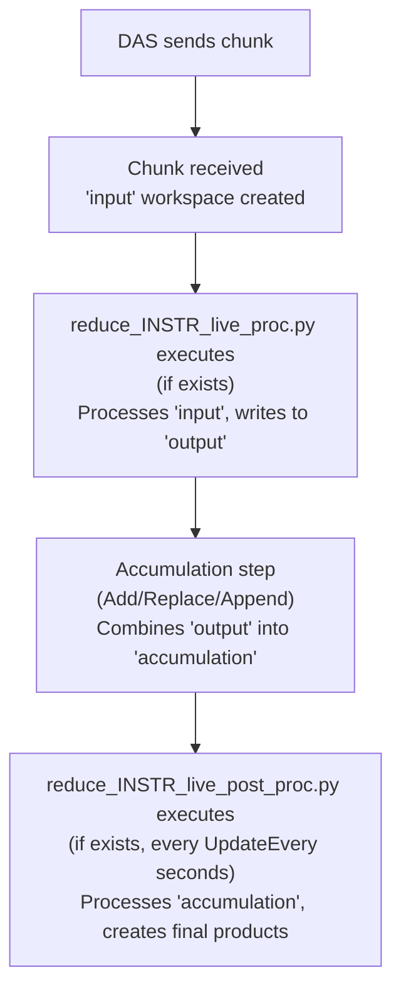

# Processing Scripts

This guide covers creating, testing, and deploying processing scripts for live reduction.



## Script Naming Convention

Scripts **must** follow this naming pattern:
```
reduce_<INSTRUMENT>_live_proc.py          # Processing script
reduce_<INSTRUMENT>_live_post_proc.py     # Post-processing script
```

Where `<INSTRUMENT>` is the instrument short name (e.g., "POWGEN", "REF_M", "NOMAD").

**Examples**:
- `reduce_POWGEN_live_proc.py`
- `reduce_POWGEN_live_post_proc.py`
- `reduce_REF_M_live_proc.py`
- `reduce_REF_M_live_post_proc.py`

**Requirements**:
- At least one script (`proc` or `post_proc`) must exist
- Both scripts are optional, but having both is common
- Scripts must be in the configured `script_dir` (default: `/SNS/{INSTRUMENT}/shared/livereduce`)

## Processing Script Structure

The processing script receives each chunk and processes it.

### Template

```python
# File: reduce_POWGEN_live_proc.py
from mantid.simpleapi import (
    Rebin,
    SumSpectra,
    ConvertUnits,
    DiffractionFocussing
)

# Available variables:
# - input: The incoming data chunk (workspace)
# - output: Where to put results (workspace name as string)

# Example: Basic powder diffraction processing
ConvertUnits(InputWorkspace=input, OutputWorkspace=output, Target="dSpacing")
DiffractionFocussing(InputWorkspace=output, OutputWorkspace=output,
                      GroupingFileName="/SNS/POWGEN/shared/cal_2024_01.cal")
Rebin(InputWorkspace=output, OutputWorkspace=output, Params="0.5,-0.001,2.5")
```

### Key Points

**Variables**:
- `input`: The incoming data chunk (workspace object)
- `output`: Where to put results (workspace name as string)
- No function definitions needed - just executable code

**Performance**:
- Keep operations fast - runs on every chunk
- Avoid file I/O - save that for post-processing
- Test with various chunk sizes (they vary!)
- Script blocks receiving new chunks while running

**Common Operations**:
- Basic rebinning
- Spectrum summing
- Simple filtering
- Unit conversions
- Detector grouping

**Anti-patterns**:
```python
# DON'T: Define variables that don't exist
InputWorkspace="input_ws"  # This variable doesn't exist!

# DO: Use the provided variables
InputWorkspace=input
OutputWorkspace=output

# DON'T: File I/O in processing
SaveNexus(...)  # Too slow!

# DO: File I/O in post-processing only

# DON'T: Heavy computations
FitPeak(...)  # Takes too long!

# DO: Keep it lightweight
Rebin(...)  # Fast operation
```

## Post-Processing Script Structure

The post-processing script processes accumulated data.

### Template

```python
# File: reduce_POWGEN_live_post_proc.py
import os
from mantid.simpleapi import (
    SaveNexus,
    SaveAscii,
    Integration,
    DeleteWorkspace
)

# Available workspaces:
# - accumulation: All accumulated data
# - Any other workspaces created during processing

# Get run info for file naming
run = accumulation.getRun()
run_number = run.getProperty("run_number").value

# Output directory
output_dir = "/SNS/POWGEN/shared/livereduce"
os.makedirs(output_dir, exist_ok=True)

# Save data files
SaveNexus(InputWorkspace="accumulation",
          Filename=f"{output_dir}/POWGEN_{run_number}_live.nxs")

# Create a summary workspace
integrated = Integration(InputWorkspace="accumulation")
SaveAscii(InputWorkspace=integrated,
          Filename=f"{output_dir}/POWGEN_{run_number}_integrated.txt")

# Clean up temporary workspaces
DeleteWorkspace(integrated)
```

### Key Points

**Workspaces**:
- `accumulation`: All data accumulated so far
- Any workspaces created during processing
- Can create temporary workspaces for calculations

**Timing**:
- Runs every `UpdateEvery` seconds (default 30)
- Non-blocking - doesn't prevent chunk processing
- Can take longer than processing scripts

**Appropriate Operations**:
- File I/O (saving results)
- Background subtraction
- Normalization
- Peak fitting
- Web service updates
- Database writes
- Complex calculations

**Error Handling**:
```python
# Good practice: Handle errors gracefully
try:
    SaveNexus(InputWorkspace="accumulation", Filename=output_file)
except Exception as e:
    # Errors appear in service logs
    print(f"Failed to save file: {e}")
    # Continue processing - don't crash the service
```

## Testing Scripts Locally

Before deploying, test with fake data servers:

### Setup

```bash
# Terminal 1: Start fake data server
cd /path/to/livereduce/repo
pixi shell
python test/fake_server.py
```

```bash
# Terminal 2: Run livereduce with test config
pixi shell
python scripts/livereduce.py test/fake.conf
```

```bash
# Terminal 3: Watch the logs
tail -f livereduce.log
```

### What to Test

- **Syntax**: Script runs without Python errors
- **Logic**: Produces expected outputs
- **Performance**: Completes quickly enough
- **Memory**: Doesn't consume excessive memory
- **Error handling**: Fails gracefully on bad input

### Test Configurations

Use the provided test configs as templates:

**Histogram data**:
```bash
python scripts/livereduce.py test/fake.conf
```

**Event data**:
```bash
python scripts/livereduce.py test/fake_event.conf
```

**Post-processing only**:
```bash
python scripts/livereduce.py test/postprocessing/fake.conf
```

## Memory Considerations

Event data can consume significant memory.

### Event Preservation

```python
# This keeps ALL events in memory (grows unbounded!):
Rebin(InputWorkspace=input, OutputWorkspace=output,
      Params="1000,100,20000", PreserveEvents=True)

# This converts to histogram (much less memory):
Rebin(InputWorkspace=input, OutputWorkspace=output,
      Params="1000,100,20000", PreserveEvents=False)  # Recommended
```

### Configuration

Set memory limits in `/etc/livereduce.conf`:
```json
{
  "preserve_events": false,
  "system_mem_limit_perc": 70,
  "mem_check_interval_sec": 1
}
```

When memory exceeds the limit, the daemon automatically restarts processing.

### Monitoring Memory

During testing:
```bash
# Overall system memory
watch -n 1 free -h

# Specific process
watch -n 1 "ps aux | grep livereduce | grep -v grep"

# Or use htop
htop -p $(pgrep -f livereduce.py)
```

## Example Scripts

### Simple Rebinning (Processing)

```python
from mantid.simpleapi import Rebin

# Rebin to common TOF range
Rebin(InputWorkspace=input, OutputWorkspace=output,
      Params="1000,100,20000", PreserveEvents=False)
```

### Spectrum Summation (Processing)

```python
from mantid.simpleapi import SumSpectra

# Sum all spectra for quick visualization
SumSpectra(InputWorkspace=input, OutputWorkspace=output)
```

### File Output (Post-Processing)

```python
import os
from mantid.simpleapi import SaveNexus, SaveAscii

output_dir = "/SNS/INSTR/shared/livereduce"
os.makedirs(output_dir, exist_ok=True)

# Save NeXus file
SaveNexus(InputWorkspace="accumulation",
          Filename=f"{output_dir}/live_data.nxs")

# Save ASCII for quick viewing
SaveAscii(InputWorkspace="accumulation",
          Filename=f"{output_dir}/live_data.txt")
```

### Instrument-Specific Example (REF_M)

```python
# Processing script
from mantid.simpleapi import ConvertUnits, Rebin

# Convert to wavelength
ConvertUnits(InputWorkspace=input, OutputWorkspace=output,
             Target="Wavelength")

# Rebin in wavelength
Rebin(InputWorkspace=output, OutputWorkspace=output,
      Params="2.5,0.1,15", PreserveEvents=False)
```

```python
# Post-processing script
from mr_reduction import reduce_reflectivity

# Use instrument-specific reduction
result = reduce_reflectivity(workspace="accumulation")

# Save results
result.save("/SNS/REF_M/shared/livereduce/")
```

## Common Patterns

### Accessing Run Information

```python
# Get run number
run = accumulation.getRun()
run_number = run.getProperty("run_number").value

# Get IPTS number (SNS)
ipts = run.getProperty("experiment_identifier").value

# Get start time
start_time = run.getProperty("run_start").value
```

### Conditional Processing

```python
# Only process if enough counts
total_counts = accumulation.getNumberEvents()
if total_counts > 1000000:
    # Do heavy analysis
    pass
else:
    print("Not enough counts yet, skipping analysis")
```

### Creating Output Directories

```python
import os

# Ensure directory exists
output_dir = "/SNS/INSTR/IPTS-12345/shared/livereduce"
os.makedirs(output_dir, exist_ok=True)

# Create timestamped subdirectories
from datetime import datetime
timestamp = datetime.now().strftime("%Y%m%d_%H%M%S")
run_dir = os.path.join(output_dir, f"run_{run_number}_{timestamp}")
os.makedirs(run_dir, exist_ok=True)
```

## Troubleshooting Scripts

### Script Not Found

```bash
# Check file exists
ls -la /SNS/INSTR/shared/livereduce/reduce_*

# Check permissions
sudo -u snsdata ls -la /SNS/INSTR/shared/livereduce/
```

### Script Has Errors

```bash
# View Python tracebacks in logs
grep -A 20 "Traceback" /var/log/SNS_applications/livereduce.log

# Test script interactively
python3 -c "
from mantid.simpleapi import *
input = Load('test_data.nxs')
output = 'test_output'
exec(open('reduce_INSTR_live_proc.py').read())
"
```

### Script Not Updating

```bash
# Check if file actually changed
md5sum /SNS/INSTR/shared/livereduce/reduce_*

# Check what daemon sees
grep "md5" /var/log/SNS_applications/livereduce.log

# Force restart
sudo systemctl restart livereduce
```

## Best Practices

### Performance
- Profile scripts with realistic data before deploying
- Keep processing scripts under 1 second execution time
- Post-processing can take longer but aim for < `UpdateEvery` seconds

### Maintainability
- Comment complex operations
- Use descriptive variable names
- Document expected inputs/outputs
- Version control your scripts

### Reliability
- Handle errors gracefully
- Don't crash on unexpected input
- Log useful error messages
- Test edge cases

### Deployment
- Test locally before production
- Deploy during low-activity periods
- Monitor logs after deployment
- Keep backups of working versions

## Related Documentation

- [Architecture](architecture.md) - How processing fits into the system
- [Developer Guide](developer-guide.md) - Deployment procedures
- [Configuration Reference](configuration.md) - Configuring script behavior
- [Troubleshooting](troubleshooting.md) - Fixing script problems
