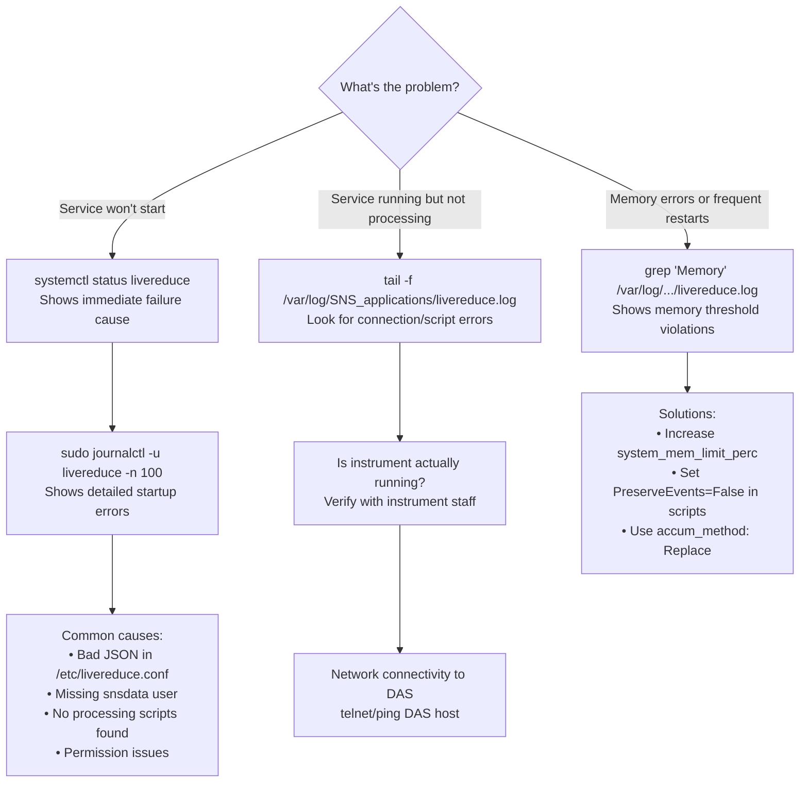

# Troubleshooting

This guide helps diagnose and fix common live reduction problems.

## Where to Look

Check these locations in order when things go wrong:



### 1. Service Status

```bash
systemctl status livereduce
```

**Look for**:
- `active (running)` = service is up
- `failed` or `inactive` = service crashed or stopped
- Recent log lines at bottom

### 2. Main Service Log

```bash
tail -f /var/log/SNS_applications/livereduce.log
```

Or systemd journal:
```bash
sudo journalctl -u livereduce -f
```

**Shows**:
- Configuration loading
- Script detection
- Connection to DAS
- Processing errors
- Memory warnings
- Restart events

### 3. Watchdog Log (if enabled)

```bash
tail -f /var/log/SNS_applications/livereduce_watchdog.log
```

**Shows**:
- When watchdog detected inactivity
- Last 20 lines of main log before restart
- Service restart actions

### 4. Instrument-Specific Logs

Some post-processing scripts create their own logs:
```bash
ls /SNS/INSTR/shared/livereduce/*.log
tail -f /SNS/INSTR/shared/livereduce/INSTR_live_reduction.log
```

### 5. System Logs

```bash
# Check for systemd issues
sudo journalctl -xe

# Check for memory/disk issues
dmesg | tail
df -h
free -h
```

## Common Issues

### Service Won't Start

**Symptom**: `systemctl start livereduce` fails immediately

**Check 1: Configuration file syntax**
```bash
# Validate JSON
cat /etc/livereduce.conf | jq .
```
If error, fix JSON syntax.

**Check 2: Missing snsdata user**
```bash
# Check user exists
id snsdata
```
If not, create it:
```bash
sudo useradd -r -g users -G hfiradmin snsdata
```

**Check 3: Missing conda environment**
```bash
# List environments
conda env list
```
Ensure specified environment exists with Mantid installed.

**Check 4: Processing scripts not found**
```bash
# Check default location
ls -la /SNS/INSTR/shared/livereduce/reduce_*
```
At least one script must exist.

**Check 5: Permissions**
```bash
# Service runs as snsdata
sudo -u snsdata ls -la /SNS/INSTR/shared/livereduce/
```
Ensure snsdata can read scripts.

**Get specific error**:
```bash
sudo journalctl -u livereduce -n 100
```

### Service Running But Not Processing

**Symptom**: Status is "active" but no new log entries or output files

**Check 1: DAS connection**
```bash
# Look for connection errors
grep -i "connection\|listener\|timeout" /var/log/SNS_applications/livereduce.log
```

**Check 2: Active run**
- Verify instrument is running
- Check with instrument scientists

**Check 3: Processing script errors**
```bash
# Look for Python tracebacks
grep -i "error\|exception\|traceback" /var/log/SNS_applications/livereduce.log
```

**Check 4: Watchdog restart loop**
```bash
# Check for repeated restarts
grep "restarting" /var/log/SNS_applications/livereduce_watchdog.log
```

**Solutions**:
- Test scripts locally with fake server
- Check network connectivity to DAS
- Verify instrument is collecting data

### Memory Exceeded Errors

**Symptom**: Logs show "Memory usage exceeds limit", frequent restarts

**Cause**: Scripts preserve events or accumulate too much data

**Solution 1: Adjust threshold** (temporary)
```json
{
  "system_mem_limit_perc": 80
}
```

**Solution 2: Disable event preservation**

In processing scripts, change:
```python
# From:
Rebin(..., PreserveEvents=True)

# To:
Rebin(..., PreserveEvents=False)
```

Or in config:
```json
{
  "preserve_events": false
}
```

**Solution 3: Use Replace accumulation**
```json
{
  "accum_method": "Replace"
}
```

**Solution 4: Load fewer spectra**
```json
{
  "spectra": [0, 100, 200]
}
```

### Script Errors in Logs

**Symptom**: Python tracebacks in logs, processing fails

**Common Error 1: Undefined variable**
```python
# Wrong - 'input' and 'output' are pre-defined
InputWorkspace="input_ws"  # Variable doesn't exist!

# Correct
InputWorkspace=input
OutputWorkspace=output
```

**Common Error 2: Workspace doesn't exist**
```python
# Add check
from mantid.simpleapi import mtd
if mtd.doesExist("my_workspace"):
    # Use it
else:
    print("Workspace not found")
```

**Common Error 3: Invalid algorithm parameters**
```bash
# Check algorithm docs
python3 -c "from mantid.simpleapi import help; help('Rebin')"
```

**Common Error 4: File permissions**
```python
# Ensure directory exists and is writable
import os
output_dir = "/SNS/INSTR/shared/livereduce"
os.makedirs(output_dir, exist_ok=True)
```

**Solution**: Test scripts interactively in Workbench before deploying

### Watchdog Repeatedly Restarting

**Symptom**: Service starts, runs briefly, restarts continuously

**Normal Case: "Run paused/resumed" spam**

These are NOT problems:
```
2026-01-21 09:40:13 - Mantid - INFO - Run paused
2026-01-21 09:40:13 - Mantid - INFO - Run resumed
```

**Indicates**:
- Alignment scans
- Polarized beam spin state changes
- Rocking curve measurements
- Normal operations

**Problem Case 1: Scripts too slow**
- Watchdog sees no log entries for `threshold` seconds
- **Fix**: Optimize scripts or increase threshold:
  ```json
  {"watchdog": {"threshold": 600}}
  ```

**Problem Case 2: Memory crashes**
- Service crashes from memory issues
- **Fix**: Address memory configuration (see above)

**Problem Case 3: DAS connection drops**
- Network issues causing disconnects
- **Fix**: Check network, contact facility IT

### Script Changes Not Detected

**Symptom**: Updated script but behavior unchanged

**Check 1: File actually changed**
```bash
# Check modification time
ls -l /SNS/INSTR/shared/livereduce/reduce_*

# Compare MD5
md5sum /SNS/INSTR/shared/livereduce/reduce_*
```

**Check 2: Daemon detected change**
```bash
# Look for restart message
grep "changed - restarting" /var/log/SNS_applications/livereduce.log
```

**Check 3: Permissions**
```bash
# Ensure snsdata can read
sudo -u snsdata cat /SNS/INSTR/shared/livereduce/reduce_INSTR_live_proc.py
```

**Solution**: Force restart
```bash
sudo systemctl restart livereduce
```

## Debugging Techniques

### Running Manually

Stop service and run manually for full output:

```bash
# Stop service
sudo systemctl stop livereduce

# Run as snsdata user
sudo -u snsdata bash
cd /tmp
python3 /usr/bin/livereduce.py /etc/livereduce.conf
```

**Benefits**:
- See all output in console
- Python tracebacks appear immediately
- Easy to interrupt (Ctrl+C)
- Better for debugging script errors

### Testing with Fake Data

Use test infrastructure to simulate live data:

```bash
# Terminal 1: Start fake server
cd /path/to/livereduce/repo
pixi shell
python test/fake_server.py

# Terminal 2: Run livereduce
pixi shell
python scripts/livereduce.py test/fake.conf

# Terminal 3: Watch logs
tail -f livereduce.log
```

**Benefits**:
- Test without real instrument
- Rapid iteration on scripts
- Verify configuration changes
- Test memory monitoring

### Checking MD5 Sums

Daemon detects script changes via MD5 checksums:

```bash
# See what daemon calculated
grep "md5" /var/log/SNS_applications/livereduce.log

# Calculate manually
md5sum /SNS/INSTR/shared/livereduce/reduce_*
```

**If scripts not updating**:
- Verify file changed
- Check permissions
- Ensure inotify working

### Monitoring Memory

Watch memory in real-time:

```bash
# Overall system
watch -n 1 free -h

# Specific process
watch -n 1 "ps aux | grep livereduce | grep -v grep"

# Interactive monitoring
htop -p $(pgrep -f livereduce.py)
```

**Configure appropriately**:
```json
{
  "system_mem_limit_perc": 70,
  "mem_check_interval_sec": 2
}
```

### Verifying DAS Connection

Test network connectivity:

```bash
# For TCP listeners
telnet bl-dassrv1.facility.gov 31415

# Check firewall
sudo iptables -L -n | grep <port>

# DNS resolution
nslookup bl-dassrv1.facility.gov

# Ping test
ping -c 3 bl-dassrv1.facility.gov
```

## Service Management

### Basic Operations

```bash
# Start
sudo systemctl start livereduce

# Stop
sudo systemctl stop livereduce

# Restart
sudo systemctl restart livereduce

# Status
systemctl status livereduce
sudo systemctl status livereduce  # More details

# Enable at boot
sudo systemctl enable livereduce

# Disable at boot
sudo systemctl disable livereduce
```

### When to Restart vs Investigate

**Restart when**:
- Configuration file changed (required)
- Service shows "failed"
- Making routine updates
- Testing new scripts

**Investigate before restarting when**:
- Service "active" but not working
- Repeated auto-restarts
- Memory/disk issues suspected
- New scripts just deployed (auto-restarts)

### Checking Processes

```bash
# All snsdata processes
ps -u snsdata -o pid,etime,stat,command

# Process tree
pstree -p $(pgrep -f livereduce.py)

# Open files
sudo lsof -p $(pgrep -f livereduce.py)

# Network connections
sudo netstat -tnp | grep livereduce
```

### Managing Watchdog

Watchdog is independent:

```bash
# Watchdog operations
sudo systemctl start livereduce_watchdog
sudo systemctl stop livereduce_watchdog
systemctl status livereduce_watchdog

# Stopping watchdog doesn't affect main service
```

**Disable watchdog when**:
- Doing maintenance
- Testing interactively
- Investigating restart issues
- Too aggressive for workload

**Enable watchdog when**:
- Production operation
- Unattended running
- Service has stalling issues
- Want automatic recovery

### Log Management

```bash
# Check size
ls -lh /var/log/SNS_applications/livereduce.log

# Rotate manually
sudo logrotate -f /etc/logrotate.d/livereduce

# Truncate
sudo truncate -s 0 /var/log/SNS_applications/livereduce.log
```

**Set up rotation** (`/etc/logrotate.d/livereduce`):
```
/var/log/SNS_applications/livereduce.log {
    daily
    rotate 7
    compress
    missingok
    notifempty
}
```

## Error Messages Reference

### "No instrument found"

**Cause**: `instrument` not in config and not in `/etc/mantid.local.properties`

**Fix**: Add to config:
```json
{"instrument": "POWGEN"}
```

### "ProcessingScriptFilename is empty"

**Cause**: Script file exists but is 0 bytes

**Fix**: Check file has content:
```bash
ls -l /SNS/INSTR/shared/livereduce/reduce_*
```

### "Must provide at least one script"

**Cause**: Neither proc nor post_proc script exists

**Fix**: Create at least one:
```bash
touch /SNS/INSTR/shared/livereduce/reduce_INSTR_live_proc.py
# Add script content
```

### "Connection refused" / "Timeout"

**Cause**: Cannot connect to DAS

**Fix**:
- Check network connectivity
- Verify DAS is running
- Check firewall rules
- Contact facility IT

### "Permission denied"

**Cause**: snsdata user can't access files

**Fix**: Check permissions:
```bash
sudo chown -R snsdata:users /SNS/INSTR/shared/livereduce/
sudo chmod -R 755 /SNS/INSTR/shared/livereduce/
```

## Getting Help

### Information to Collect

When asking for help, provide:

1. **Service status**:
   ```bash
   systemctl status livereduce
   ```

2. **Recent logs**:
   ```bash
   sudo journalctl -u livereduce -n 200 > livereduce_logs.txt
   ```

3. **Configuration**:
   ```bash
   cat /etc/livereduce.conf
   ```

4. **Script locations**:
   ```bash
   ls -la /SNS/INSTR/shared/livereduce/
   ```

5. **System info**:
   ```bash
   free -h
   df -h
   uname -a
   ```

### Contact Points

- GitHub Issues: https://github.com/mantidproject/livereduce/issues
- Mantid Help: https://mantidproject.org/help
- Facility IT: Contact your facility's support team

## Related Documentation

- [Architecture](architecture.md) - System design
- [Developer Guide](developer-guide.md) - Setup procedures
- [Processing Scripts](processing-scripts.md) - Script troubleshooting
- [Configuration Reference](configuration.md) - Configuration options
